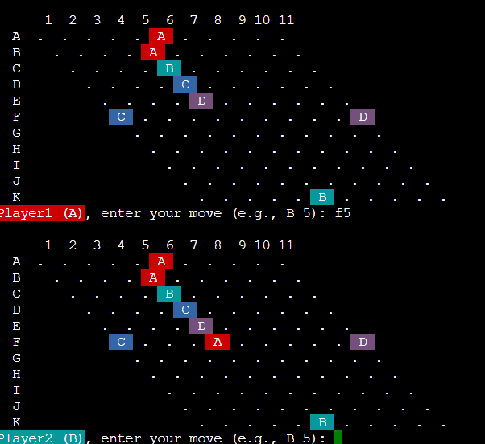

# 4-Player Hex Game (C Language)

This is a professional C implementation of a *4-player Hex game* on an 11x11 board.

✅ Clean modular code  
✅ Input validation  
✅ Win checking  
✅ Optional color support (ANSI colors in supported terminals)  
✅ Player representation using colored dots / symbols  

## Features

- 4-player gameplay on an 11x11 hexagonal grid.
- Modular code structure (main logic, input handling, board drawing, win checking).
- Input validation for moves.
- Detects and announces winning player.
- Optional use of colored dots to represent players if terminal supports ANSI colors.
- Clean, organized board display.

## Screenshot



## License

This project is shared for educational and demonstration purposes.  
For any commercial use, please contact the author.

## Author

Youssef962

### Compile:

```bash
gcc joeeeelking3.c -o hexgame
